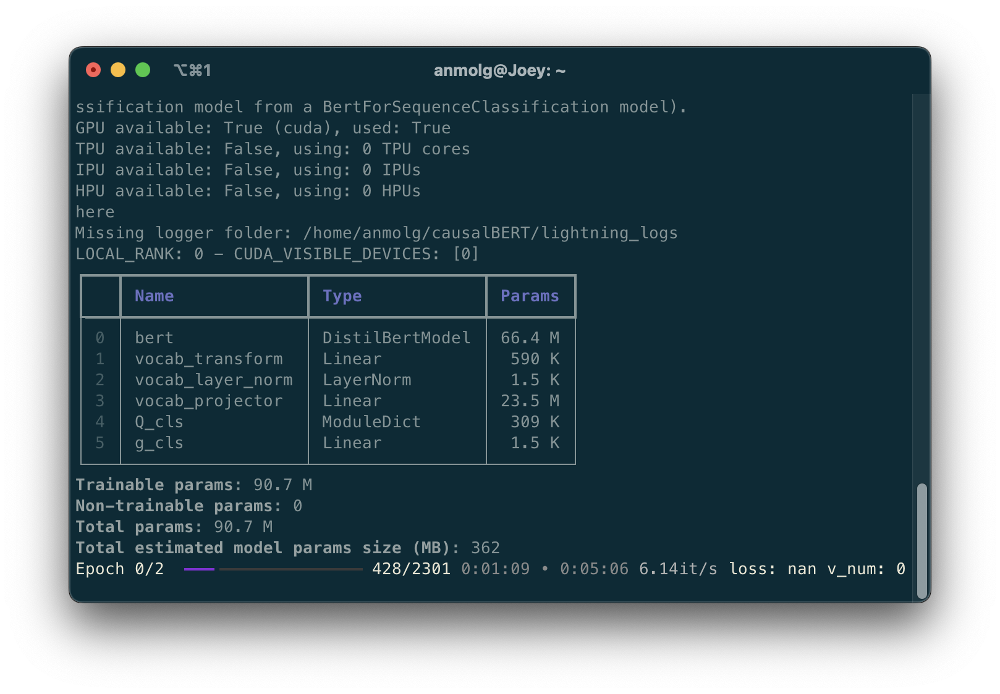
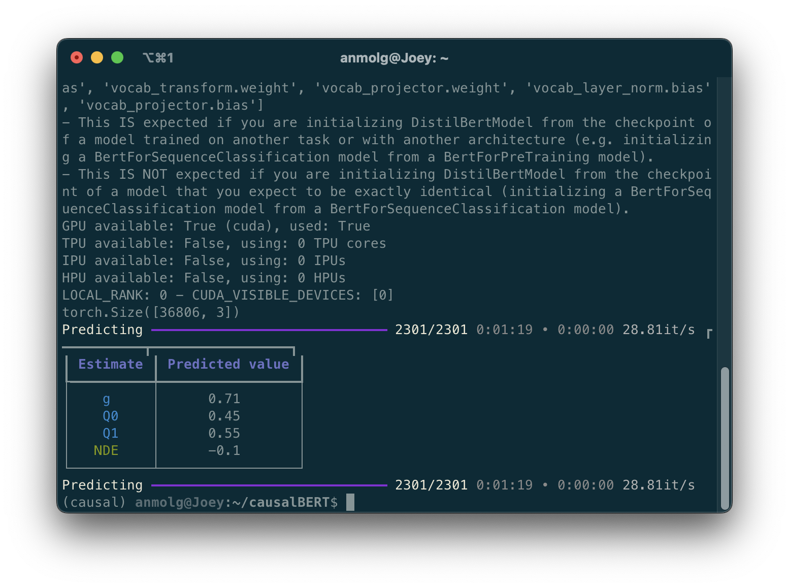

---

<div align="center">    
 
# CausalBERT   

[](https://arxiv.org/abs/1905.12741)
[](https://proceedings.mlr.press/v124/veitch20a.html)  


<!--  
Conference   
-->   
</div>
 
## Description   
PyTorch (Lightning) based implementation of [Adapting Text Embeddings for Causal Inference](https://proceedings.mlr.press/v124/veitch20a.html)

## How to run   
First, install dependencies   
```bash
# clone project   
git clone https://github.com/agoel00/causalBERT

# install project   
cd causalBERT
pip install -r requirements.txt
 ```   

Training CausalBERT 
 ```bash
python run.py fit --accelerator gpu --batch_size 8
```


Inference using the trained CausalBERT checkpoint
```bash
python run.py predict --accelerator gpu --batch_size 8 --ckpt_path last
```


## Credits
A lot of the training logic is taken from https://github.com/rpryzant/causal-bert-pytorch.